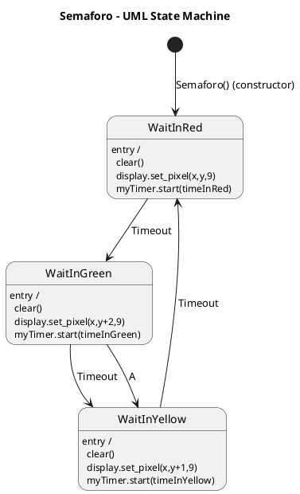
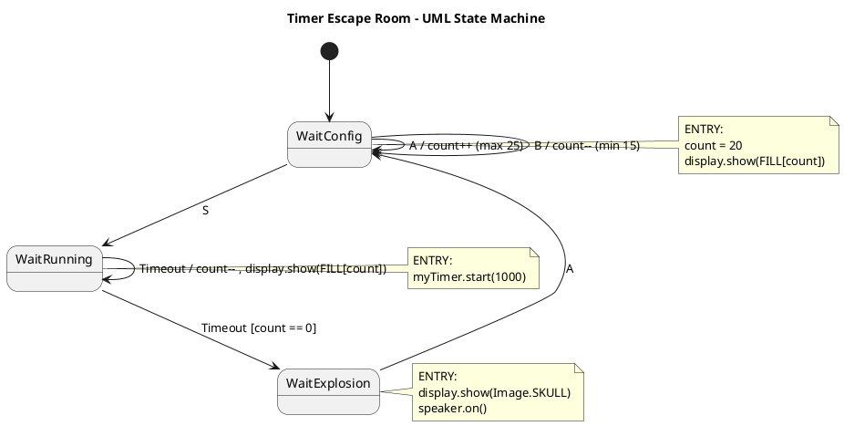

# Unidad 2

## Bitácora de proceso de aprendizaje

### Actividad 01 – Análisis de una Máquina de Estados Simple**

El programa controla dos píxeles del micro:bit que parpadean a diferentes velocidades utilizando una máquina de estados y una clase Timer para manejar el tiempo sin bloquear la ejecución (sin usar sleep()).
Cada objeto Pixel funciona como una máquina de estados independiente.

**¿Cuáles son los estados en el programa?**
Primera versión (un solo estado)

En la primera implementación existe un único estado:
estado_waitTimeout
Este estado:
En ENTRY enciende el píxel.
En Timeout cambia el valor del píxel (ON ↔ OFF).
Aquí el comportamiento ON/OFF se controla dentro del mismo estado, usando una condición sobre pixelState.

**Segunda versión (modelo más claro)**
En la segunda implementación existen dos estados explícitos:
estado_waitInON
estado_waitInOFF
Aquí el comportamiento es más limpio porque:
estado_waitInON → El píxel está encendido.
estado_waitInOFF → El píxel está apagado.
Cada estado representa claramente una condición del sistema.

**¿Cuáles son los eventos en el programa?**

Los eventos que maneja la máquina de estados son:
"ENTRY" → Se ejecuta al entrar a un estado.
"EXIT" → Se ejecuta al salir de un estado.
"Timeout" → Evento generado por el Timer cuando se cumple el tiempo configurado.

El evento más importante del sistema es:

```python
"Timeout"
```
Este evento es generado automáticamente por la clase Timer cuando el tiempo se cumple:
```python
self.owner.post_event(self.event)
```
Es decir:
El temporizador detecta que pasó el tiempo.
Publica el evento "Timeout".
La máquina de estados lo procesa.

**¿Cuáles son las acciones en el programa?**

Las acciones son las operaciones que ejecuta el sistema cuando ocurre un evento.
Las principales acciones son:

Encender el píxel
```python
self.pixelState = 9
display.set_pixel(self.x,self.y,self.pixelState)
```
Apagar el píxel
```python
self.pixelState = 0
display.set_pixel(self.x,self.y,self.pixelState)
```
Iniciar el temporizador
```python
self.myTimer.start()
```
Transicionar a otro estado (segunda versión)
```python
self.transicion_a(self.estado_waitInOFF) /// o "self.transicion_a(self.estado_waitInON)"
```

**Reflexión**
Este ejercicio demuestra cómo una máquina de estados permite modelar comportamientos temporizados sin bloquear la ejecución del programa.
A diferencia del uso de sleep(), aquí el sistema sigue funcionando de manera concurrente porque:
Los temporizadores no detienen el programa.
Cada objeto Pixel gestiona sus propios eventos.
El while True solo coordina actualizaciones periódicas.
La segunda versión del modelo es más clara porque separa explícitamente los estados:
ON
OFF

Esto mejora:
La legibilidad
La escalabilidad
La mantenibilidad del código

### Actividad 02 – Semáforo con Máquina de Estados

Se implementa un semáforo utilizando una máquina de estados en MicroPython.

**La secuencia normal es:**
Rojo → 2 segundos
Verde → 1 segundo
Amarillo → 0.5 segundos
Repite el ciclo

**La modificación solicitada es:**
Cuando el semáforo esté en verde y se presione el botón A, debe cambiar inmediatamente a amarillo sin esperar el Timeout.
El evento que se debe publicar es:
```python
post_event("A")
```
esto significa que ahora el estado Verde tiene dos posibles transiciones

**Identificación de la Máquina de Estados**
Estados
WaitInRed
WaitInGreen
WaitInYellow

**Cada estado representa un color activo del semáforo.**
Eventos
"ENTRY"
"EXIT"
"Timeout"
"A" (nuevo evento generado por el botón)
el evento "A" solo tiene efecto en el estado verde

**Transiciones clave**
Red → Green por Timeout
Green → Yellow por Timeout
Green → Yellow por "A" (modificación)
Yellow → Red por Timeout

**Máquina de Estados en PlantUML**
Este es el modelo construido en PlantUML:



**Análisis del comportamiento modificado**
El estado WaitInGreen ahora tiene dos transiciones salientes:
```plantuml
WaitInGreen --> WaitInYellow : Timeout
WaitInGreen --> WaitInYellow : A
```
Esto significa que:
Si se cumple el tiempo → cambia a amarillo.
Si se presiona botón A → cambia inmediatamente a amarillo.
esto modela una interrupción manual del ciclo automático

Para que esto funcione correctamente en el programa real, dentro del while True debería existir algo como:
```python
if button_a.was_pressed():
    semaforo1.post_event("A")
```
si no se postea el evento, la transición nunca ocurrirá

**Reflexión**
Esta modificación demuestra que:
Una máquina de estados permite agregar comportamiento nuevo sin romper la estructura.
El sistema es reactivo a eventos externos.
El diseño basado en eventos es más flexible que una lógica secuencial con sleep().
Además, el modelo ahora representa un sistema que puede ser:
Automático (por tiempo)
Reactivo (por entrada del usuario)

### Actividad 03 – Máquina de Estados con Botones

El programa muestra una secuencia cíclica de imágenes en el micro:bit:
Heart → 2.5 s
Pacman → 1 s
Ghost → 2 s
Repite el ciclo
Además, si se presiona el botón A, el sistema salta inmediatamente a otro estado dependiendo de cuál esté activo.
vemos que el sistema debe atender tiempo y botón al mismo tiempo

**¿Cómo es posible estructurar la aplicación para atender eventos concurrentes?**

La clave está en tres elementos:

**Arquitectura basada en eventos**
El sistema no usa sleep() para controlar la duración de cada imagen.

En lugar de eso:
El Timer genera un evento "Timeout".
El botón genera un evento "A".
Ambos se agregan a event_queue.
La máquina de estados procesa los eventos uno por uno.
```python
if button_a.was_pressed():
    game.post_event("A")
```
esto convierte una acción física en un evento del sistema

**Separación clara entre:**
Generación de eventos (Timer, botón)
Procesamiento de eventos (máquina de estados)
Comportamiento del estado actual

Esto permite que:
El tiempo siga corriendo
El botón pueda interrumpir en cualquier momento
El sistema nunca se bloquee

**No hay bloqueos**
El while True solo hace:
```python
game.update()
utime.sleep_ms(20)
```
El sleep_ms(20) es mínimo y no detiene la lógica interna del sistema.
esto es concurrencia cooperativa, no paralelismo real

**Estados del sistema**
waitInHeart
waitInPacman
waitInGhost

Cada estado define:
Qué imagen mostrar
Cuánto tiempo durar
Qué hacer ante Timeout
Qué hacer ante "A"

**Eventos del sistema**
"ENTRY"
"EXIT"
"Timeout"
"A"

**Transiciones importantes**
*Flujo automático (por tiempo)*
Heart → Pacman → Ghost → Heart
*Flujo por botón A*
Heart --A--> Ghost
Pacman --A--> Heart
Ghost --A--> Pacman

el botón crea un ciclo alterno diferente al automático

**¿Cómo probar que el programa está correcto?**

Para validar el comportamiento debemos verificar:

**Secuencia automática correcta**
Sin presionar botón:
Heart dura 2.5 s
Pacman dura 1 s
Ghost dura 2 s
El ciclo se repite

**Interrupción inmediata**
Presionar botón A en cada estado:
En Heart → debe ir a Ghost
En Pacman → debe ir a Heart
En Ghost → debe ir a Pacman
La transición debe ser inmediata, no esperar Timeout.

**Robustez del sistema**
Presionar botón repetidamente y rápido:
El sistema no debe congelarse.
No debe saltarse estados inesperadamente.
No debe quedarse sin mostrar imagen.
esto prueba que la cola de eventos funciona correctamente


**Análisis conceptual importante**

Lo interesante aquí es que existen dos flujos superpuestos:
Flujo temporal (automático)
Flujo reactivo (botón)
La máquina de estados permite modelar ambos sin mezclar condicionales caóticos.

Si esto se hiciera con if anidados sin máquina de estados, el código sería más difícil de escalar.

**¿Hay algo que aún no comprendo completamente?**

Una parte que genera duda es:

¿Por qué no se usa un if-elif gigante en lugar de estados?

La respuesta es:
Porque cada estado encapsula su propio comportamiento y sus propias transiciones.
Eso hace que:
El código sea modular.
Sea más fácil agregar nuevos estados.
Se pueda razonar sobre el sistema como un modelo formal.

esta es la diferencia entre programar “que funcione” y programar con arquitectura

**Refelxión**

Esta implementación demuestra cómo una máquina de estados permite:
Manejar tiempo y entradas de usuario simultáneamente.
Modelar comportamientos complejos de forma clara.
Mantener el sistema reactivo sin bloquear ejecución.
Es un diseño orientado a eventos, típico de sistemas embebidos reales.

Un sistema embebido es un sistema computacional diseñado para cumplir una función específica dentro de un dispositivo más grande. 
En pocas palabras:
Es una pequeña computadora especializada que vive dentro de otro dispositivo y hace que ese dispositivo funcione.


## Bitácora de aplicación 

Voy a estructurarlo como bitácora completa:
1. Modelo conceptual
2. Máquina de estados en PlantUML
3. Implementación en MicroPython
4. Comentarios estratégicos

### Actividad 04 – Temporizador Interactivo con Máquina de Estados

**Análisis del problema**

*El sistema tiene dos modos principales:*

Modo Configuración (Desarmado)
Se puede ajustar el número de pixeles (15–25).
Eventos válidos: "A" (sube), "B" (baja), "S" (arma).

Modo Cuenta Regresiva (Armado)
Se apaga un pixel cada segundo.
Evento "Timeout" reduce el conteo.
Cuando llega a 0 → estado final.

Modo Explosión
Muestra calavera.
Suena speaker.

Evento "A" reinicia el sistema.

*Estados Identificados*
WaitConfig
WaitRunning
WaitExplosion

*Máquina de Estados – PlantUML*



**Implementación en MicroPython**
Restricciones:
Usar Timer
Usar make_fill_images
Usar eventos “A”, “B”, “S”
No usar sleep() en la máquina de estados
```python
from microbit import *
import utime

# ===== IMÁGENES =====
def make_fill_images(on='9', off='0'):
    imgs = []
    for n in range(26):
        rows = []
        k = 0
        for y in range(5):
            row = []
            for x in range(5):
                row.append(on if k < n else off)
                k += 1
            rows.append(''.join(row))
        imgs.append(Image(':'.join(rows)))
    return imgs

FILL = make_fill_images()

# ===== TIMER =====
class Timer:
    def __init__(self, owner, event_to_post, duration):
        self.owner = owner
        self.event = event_to_post
        self.duration = duration
        self.start_time = 0
        self.active = False

    def start(self, new_duration=None):
        if new_duration is not None:
            self.duration = new_duration
        self.start_time = utime.ticks_ms()
        self.active = True

    def stop(self):
        self.active = False

    def update(self):
        if self.active:
            if utime.ticks_diff(utime.ticks_ms(), self.start_time) >= self.duration:
                self.active = False
                self.owner.post_event(self.event)

# ===== TASK =====
class Task:
    def __init__(self):
        self.event_queue = []
        self.timers = []
        self.count = 20
        self.myTimer = self.createTimer("Timeout", 1000)

        self.estado_actual = None
        self.transicion_a(self.estado_waitConfig)

    def createTimer(self,event,duration):
        t = Timer(self, event, duration)
        self.timers.append(t)
        return t

    def post_event(self, ev):
        self.event_queue.append(ev)

    def update(self):
        for t in self.timers:
            t.update()

        while len(self.event_queue) > 0:
            ev = self.event_queue.pop(0)
            if self.estado_actual:
                self.estado_actual(ev)

    def transicion_a(self, nuevo_estado):
        if self.estado_actual:
            self.estado_actual("EXIT")
        self.estado_actual = nuevo_estado
        self.estado_actual("ENTRY")

    # ===== ESTADOS =====

    def estado_waitConfig(self, ev):
        if ev == "ENTRY":
            self.count = 20
            display.show(FILL[self.count])

        if ev == "A" and self.count < 25:
            self.count += 1
            display.show(FILL[self.count])

        if ev == "B" and self.count > 15:
            self.count -= 1
            display.show(FILL[self.count])

        if ev == "S":
            self.transicion_a(self.estado_waitRunning)

    def estado_waitRunning(self, ev):
        if ev == "ENTRY":
            self.myTimer.start(1000)
            
        if ev == "A":
            self.myTimer.stop()
            self.transicion_a(self.estado_waitConfig)

        if ev == "Timeout":
            self.count -= 1
            display.show(FILL[self.count])

            if self.count == 0:
                self.transicion_a(self.estado_waitExplosion)
            else:
                self.myTimer.start(1000)

    def estado_waitExplosion(self, ev):
        if ev == "ENTRY":
            display.show(Image.SKULL)
            pin0.write_digital(1)  # speaker ON

        if ev == "A":
            pin0.write_digital(0)  # speaker OFF
            self.transicion_a(self.estado_waitConfig)


# ===== LOOP PRINCIPAL =====
task = Task()

while True:
    if button_a.was_pressed():
        task.post_event("A")
    if button_b.was_pressed():
        task.post_event("B")
    if accelerometer.was_gesture("shake"):
        task.post_event("S")

    task.update()
    utime.sleep_ms(20)
```
*Validación del sistema*
Para probar que funciona correctamente:
Ajustar entre 15 y 25 pixeles.
Hacer shake → debe comenzar cuenta regresiva.
Debe apagar un pixel cada segundo.
Al llegar a 0 → mostrar calavera y activar speaker.
Presionar A → reinicia a 20 pixeles.


## Bitácora de reflexión

**Temporizador interactivo controlado desde micro:bit y p5.js**

***Objetivo del reto***
Modificar el temporizador interactivo para que pueda controlarse tanto desde los botones físicos del micro:bit como desde p5.js, usando:
A → UP
B → DOWN
S → ARMED
Sin cambiar la arquitectura de máquina de estados ya implementada.

**¿Cómo resolví el reto?**

*La clave fue entender algo fundamental:*
No debía cambiar la máquina de estados.
Solo debía agregar una nueva fuente de eventos.

*Mi arquitectura ya funcionaba así:*
La máquina de estados recibe eventos.
Los eventos se agregan a una cola (event_queue).
Cada estado decide qué hacer con el evento.
Entonces la solución no era modificar estados, sino hacer que p5.js enviara los mismos eventos que los botones físicos.

**Estrategia usada**

*Inicialicé la comunicación serial con:*
```python
uart.init(115200)
```

*En el while True, agregué la lectura del puerto serial:*
```python
if uart.any():
    data = uart.read(1)
    if data:
        letra = data.decode()
        if letra in ["A", "B", "S"]:
            task.post_event(letra)
```

*Dejé intacta la lectura de botones físicos:*
```python
if button_a.was_pressed():
    task.post_event("A")
if button_b.was_pressed():
    task.post_event("B")
if accelerometer.was_gesture("shake"):
    task.post_event("S")
```

**De esta forma:**
Si presiono botón físico → se genera evento.
Si p5.js envía letra → se genera el mismo evento.
La máqina de estados no sabe quién lo envió.
Todo funciona con la misma arquitectura.

**¿Por qué esto respeta la arquitectura?**
*Porque:*
No cambié ningún estado.
No modifiqué la clase Task.
No alteré la lógica del Timer.
Solo agregué otra fuente de eventos.

La máquina de estados sigue funcionando exactamente igual.
Solo amplié la entrada del sistema.
Eso demuestra que la arquitectura estaba bien diseñada.

Código final micro:bit
```python
from microbit import *
import utime
uart.init(115200)

# ===== IMÁGENES =====
def make_fill_images(on='9', off='0'):
    imgs = []
    for n in range(26):
        rows = []
        k = 0
        for y in range(5):
            row = []
            for x in range(5):
                row.append(on if k < n else off)
                k += 1
            rows.append(''.join(row))
        imgs.append(Image(':'.join(rows)))
    return imgs

FILL = make_fill_images()

# ===== TIMER =====
class Timer:
    def __init__(self, owner, event_to_post, duration):
        self.owner = owner
        self.event = event_to_post
        self.duration = duration
        self.start_time = 0
        self.active = False

    def start(self, new_duration=None):
        if new_duration is not None:
            self.duration = new_duration
        self.start_time = utime.ticks_ms()
        self.active = True

    def stop(self):
        self.active = False

    def update(self):
        if self.active:
            if utime.ticks_diff(utime.ticks_ms(), self.start_time) >= self.duration:
                self.active = False
                self.owner.post_event(self.event)

# ===== TASK =====
class Task:
    def __init__(self):
        self.event_queue = []
        self.timers = []
        self.count = 20
        self.myTimer = self.createTimer("Timeout", 1000)

        self.estado_actual = None
        self.transicion_a(self.estado_waitConfig)

    def createTimer(self,event,duration):
        t = Timer(self, event, duration)
        self.timers.append(t)
        return t

    def post_event(self, ev):
        self.event_queue.append(ev)

    def update(self):
        for t in self.timers:
            t.update()

        while len(self.event_queue) > 0:
            ev = self.event_queue.pop(0)
            if self.estado_actual:
                self.estado_actual(ev)

    def transicion_a(self, nuevo_estado):
        if self.estado_actual:
            self.estado_actual("EXIT")
        self.estado_actual = nuevo_estado
        self.estado_actual("ENTRY")

    # ===== ESTADOS =====

    def estado_waitConfig(self, ev):
        if ev == "ENTRY":
            self.count = 20
            display.show(FILL[self.count])

        if ev == "A" and self.count < 25:
            self.count += 1
            display.show(FILL[self.count])

        if ev == "B" and self.count > 15:
            self.count -= 1
            display.show(FILL[self.count])

        if ev == "S":
            self.transicion_a(self.estado_waitRunning)

    def estado_waitRunning(self, ev):
        if ev == "ENTRY":
            self.myTimer.start(1000)
            
        if ev == "B":
            self.myTimer.stop()
            self.transicion_a(self.estado_waitExplosion)
            
        if ev == "A":
            self.myTimer.stop()
            self.transicion_a(self.estado_waitConfig)

        if ev == "Timeout":
            self.count -= 1
            display.show(FILL[self.count])

            if self.count == 0:
                self.transicion_a(self.estado_waitExplosion)
            else:
                self.myTimer.start(1000)

    def estado_waitExplosion(self, ev):
        if ev == "ENTRY":
            display.show(Image.SKULL)
            pin0.write_digital(1)  # speaker ON

        if ev == "A":
            pin0.write_digital(0)  # speaker OFF
            self.transicion_a(self.estado_waitConfig)


# ===== LOOP PRINCIPAL =====
task = Task()

while True:

    if uart.any():
        data = uart.read(1)
        if data:
           letra = data.decode()
           if letra in ["A", "B", "S"]:
               task.post_event(letra)
    
    if button_a.was_pressed():
        task.post_event("A")
    if button_b.was_pressed():
        task.post_event("B")
    if accelerometer.was_gesture("shake"):
        task.post_event("S")

    task.update()
    utime.sleep_ms(20)
```
**Código final p5.js**
```javascript
let port;
let connectBtn;

function setup() {
  createCanvas(400,400);

  port = createSerial();

  connectBtn = createButton("Connect");
  connectBtn.mousePressed(connectBtnClick);
}

function draw() {
  if (port.availableBytes() > 0) {
    let dataRx = port.read(1);
    console.log(dataRx);
  }
}

function keyPressed() {
  
  if (!port.opened()) return;

  if (key === 'A') port.write(key);
  if (key === 'B') port.write(key);
  if (key === 'S') port.write(key);
  
}

function connectBtnClick() {
  if (!port.opened()) {
    port.open("MicroPython", 115200);
  } else {
    port.close();
  }
}
```

**Reflexión metacognitiva**

*Este reto me permitió entender que:*
Una buena arquitectura permite extender funcionalidad sin romper lo anterior.
La máquina de estados desacopla la lógica de la entrada.
Agregar nuevas entradas es simple cuando el diseño está bien hecho.
El patrón de eventos hace que el sistema sea escalable.
También comprendí que el problema no era de estados, sino de flujo de eventos.

Lo que me ayudó a conectar otra interfaz sin molestar la maquina de estados
